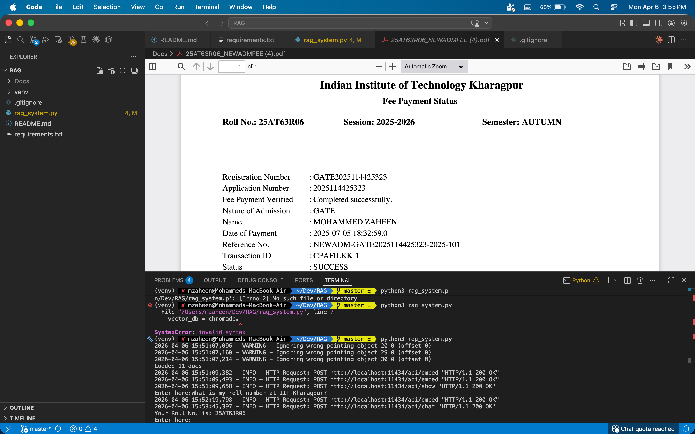

A simple RAG implementation for my personal use.

System Overview:
The system answer queries based on the PDF content stored on my device.

Tools Used:
Ollama: For pulling the large language models
LLM:  llama3.2:3b
Embedding Model: Nomic Embed
Vector Database: ChromaDB

